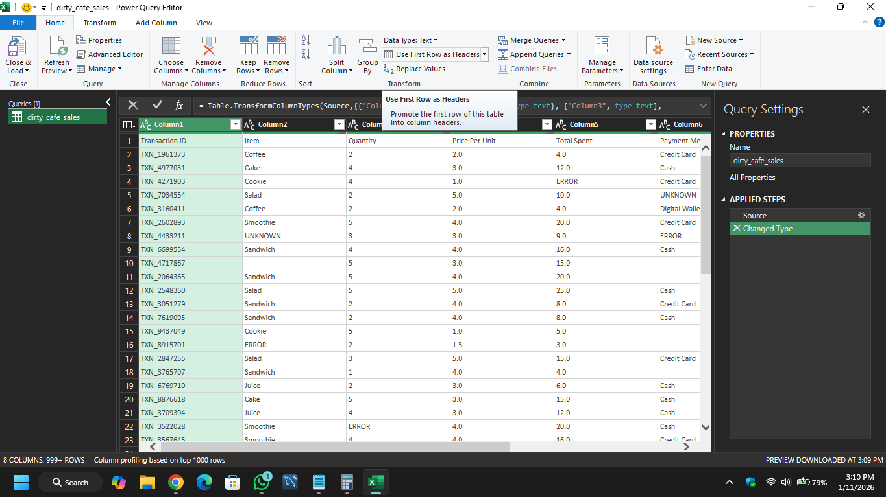
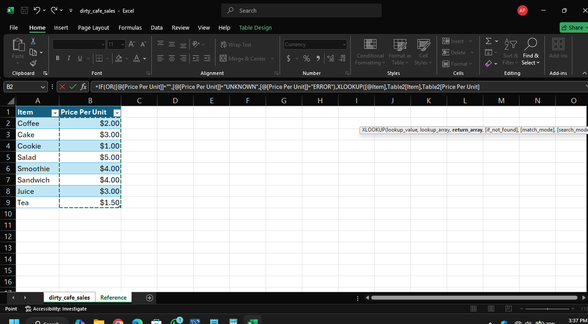
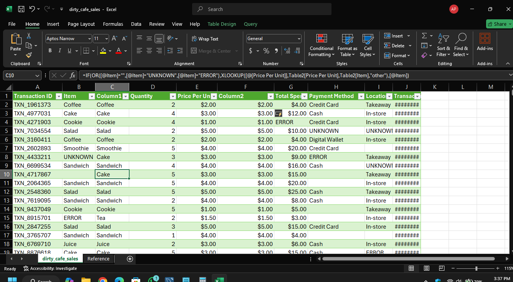

# ☕ Cafe Sales Data Cleaning Project (Excel Portfolio)

## 📌 Deskripsi Proyek
Proyek ini mendemonstrasikan proses pembersihan data (*data cleaning*) pada dataset transaksi cafe sebanyak **10.000 baris** yang memiliki banyak masalah integritas seperti nilai kosong (*blanks*), pesan kesalahan (*error*), dan nilai yang tidak teridentifikasi (*unknown*). 

Hasil akhir dari proyek ini adalah dataset bersih berjumlah **9.489 baris** yang siap digunakan untuk analisis bisnis dan visualisasi.

**Dataset Source:** Dataset ini diambil dari Kaggle: [Cafe Sales - Dirty Data for Cleaning Training](https://www.kaggle.com/datasets/ahmedmohamed2003/cafe-sales-dirty-data-for-cleaning-training) 
---

## 🛠️ Langkah-Langkah Pembersihan Data

### 1. Data Loading & Initial Formatting
- Mengimpor file CSV menggunakan **Power Query** untuk memastikan proses ETL (*Extract, Transform, Load*) yang terdokumentasi.
- Menyesuaikan header dengan mengangkat baris kedua menjadi header utama (*Promote Headers*).
- Melakukan verifikasi dan penyesuaian tipe data (*Data Type Validation*) pada kolom `Transaction Date`, `Quantity`, `Price Per Unit`, dan `Total Spent`.

<p align="left">
  
</p>
<p><i>Proses awal transformasi data menggunakan Power Query Editor untuk standarisasi format.</i></p>

## 📖 Data Dictionary (Kolom Dataset)
Berikut adalah penjelasan dari setiap kolom yang terdapat dalam dataset:

| Nama Kolom | Deskripsi |
| :--- | :--- |
| **Transaction ID** | Kode unik setiap transaksi (Primary Key). |
| **Item** | Nama produk yang terjual (Coffee, Tea, dll). |
| **Quantity** | Jumlah produk yang dibeli per transaksi. |
| **Price Per Unit** | Harga satuan produk. |
| **Total Spent** | Total nilai transaksi (Qty x Price). |
| **Payment Method** | Metode pembayaran (Cash, Credit Card, dll). |
| **Location** | Lokasi cabang cafe tempat transaksi terjadi. |
| **Transaction Date** | Tanggal dan waktu transaksi dilakukan. |

### 2. Data Auditing (Identifikasi Masalah)
Sebelum dibersihkan, dataset diperiksa untuk mengetahui skala kerusakan data:
| Kolom | Blanks | Error | Unknown |
| :--- | :---: | :---: | :---: |
| **Item** | 333 | 292 | 344 |
| **Quantity** | 138 | 170 | 171 |
| **Price** | 179 | 190 | 164 |
| **Spent** | 173 | 164 | 165 |
| **Payment** | 2579 | 306 | 293 |
| **Location** | 3265 | 358 | 338 |
| **Date** | 159 | 142 | 159 |

### 3. Pembersihan Kolom Tanggal (Data Pruning)
Karena kolom tanggal sangat krusial untuk analisis *time-series*, semua baris yang memiliki nilai **Blank, Error, dan Unknown** di kolom `Date` dihapus.
- **Data dihapus:** 460 baris.

### 4. Pemulihan Data Produk (XLOOKUP Recovery)
Menggunakan teknik *mapping* antara `Item` dan `Price Per Unit` melalui **Reference Table** (Table2). Strategi ini memulihkan data yang hilang dengan memanfaatkan konsistensi harga satuan tiap produk.

- **Logika Pengisian Data Otomatis:**
  - **Untuk Kolom Item:** Jika `Item` kosong/ERROR, sistem mencari nama item berdasarkan harga di tabel referensi.
    ```excel
    =IF(OR([@Item]="",[@Item]="UNKNOWN",[@Item]="ERROR"), XLOOKUP([@[Price Per Unit]],Table2[Price Per Unit],Table2[Item],"other"),[@Item])
    ```
  - **Untuk Kolom Price:** Jika `Price` kosong/ERROR, sistem mencari harga berdasarkan nama item di tabel referensi.
    ```excel
    =IF(OR([@[Price Per Unit]]="",[@[Price Per Unit]]="UNKNOWN",[@[Price Per Unit]]="ERROR"),XLOOKUP([@Item],Table2[Item],Table2[Price Per Unit],"other"),[@[Price Per Unit]])
    ```

- **Tindakan Lanjutan:** Menghapus **51 baris** di mana kolom Item dan Price keduanya kosong (tidak dapat dipulihkan secara logis).

#### Dokumentasi Teknis:
<p align="left">
  
  
</p>
<p><i>Kiri: Tabel Referensi sebagai acuan data | Kanan: Implementasi rumus XLOOKUP pada dataset utama.</i></p>

---

### 5. Imputasi Nilai Quantity
Mengisi data yang hilang/rusak pada kolom `Quantity` menggunakan nilai **Median** agar tidak merusak distribusi statistik data.
- **Formula:** `=IF(ISNUMBER([@Quantity]),[@Quantity],MEDIAN(D:D))`

### 6. Perhitungan Ulang Total Spent
Memastikan akurasi data finansial dengan menghitung ulang kolom `Total Spent` dari hasil perkalian kolom `Quantity` dan `Price Per Unit` yang sudah dibersihkan.
- **Formula:** `=[@Clean_Quantity] * [@Clean_Price]`

### 7. Standarisasi Kategori (Payment & Location)
Melakukan *labeling* ulang untuk kategori yang hilang atau rusak agar tetap dapat diolah dalam Pivot Table.
- **Payment Method:** Mengubah Blank/Error/Unknown menjadi `"Other"`.
- **Location:** Mengubah Blank/Error/Unknown menjadi `"Unknown Location"`.

---

## 📊 Hasil Akhir
- **Dataset Awal:** 10.000 Baris
- **Dataset Akhir:** 9.489 Baris
- **Integritas Data:** 100% Valid (Bebas dari nilai Blank, Error, dan Unknown).

## 📊 Business Insights (Pivot Charts)
Setelah proses pembersihan, saya membuat dashboard sederhana menggunakan Pivot Table & Chart untuk memvisualisasikan data yang telah pulih:

1. Revenue by Item (Product Performance)
 - Insight: Menentukan "Star Product" yang memberikan kontribusi finansial terbesar.
 - Analysis: Meskipun secara volume penjualan (Quantity) beberapa item mungkin bersaing ketat, analisis ini menunjukkan menu mana yang memiliki Profit Margin atau Value tertinggi bagi cafe.
 - Actionable Tip: Membantu manajemen menentukan menu mana yang perlu dipertahankan atau dipromosikan lebih masif (misal: strategi bundling produk terlaris).
2. Sales Trend (Time-Series Analysis)
 - Insight: Mengidentifikasi pola fluktuasi penjualan berdasarkan waktu (Harian/Bulanan).
 - Analysis: Setelah kolom Date dibersihkan, kita bisa melihat apakah ada lonjakan penjualan pada weekend atau jam-jam tertentu. Analisis ini membantu dalam pengaturan stok bahan baku dan jadwal shift karyawan.
 - Actionable Tip: Mengidentifikasi "Slow Days" di mana cafe perlu membuat promo khusus untuk meningkatkan trafik pengunjung.
3. Payment Channel Distribution (Customer Behavior)
 - Insight: Memahami preferensi transaksi pelanggan.
 - Analysis: Tingginya penggunaan metode pembayaran tertentu (misal: Digital Wallet) menunjukkan profil pelanggan yang modern/tech-savvy. Insight ini krusial untuk negosiasi biaya admin (MDR) dengan penyedia layanan pembayaran.
 - Actionable Tip: Memfokuskan kampanye cashback atau diskon pada kanal pembayaran yang paling banyak digunakan untuk meningkatkan loyalitas pelanggan.

<p align="left">
  
</p>

## 📂 Struktur Repositori
- `raw_data/dirty_cafe_sales.csv`: Dataset asli sebelum dibersihkan.
- `Cafe_Sales_Clean.xlsx`: File Excel final yang berisi data bersih dan tabel referensi.
- `README.md`: Dokumentasi proyek.

---
*Project ini dibuat sebagai bagian dari portofolio Data Cleaning oleh Ardiansyah Putra*
